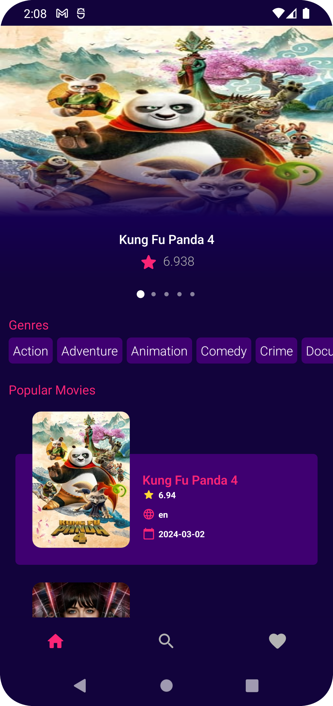
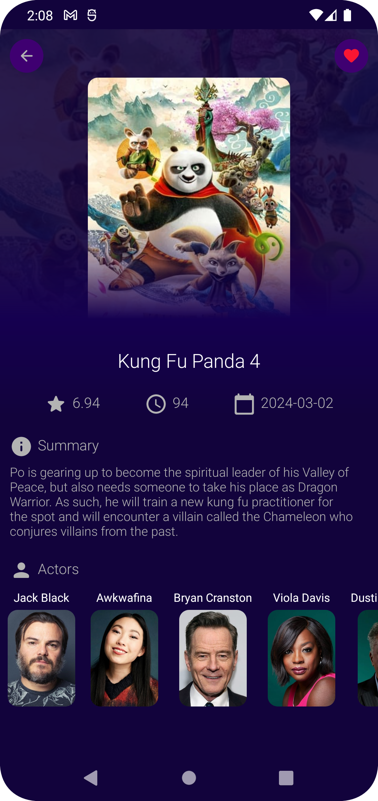
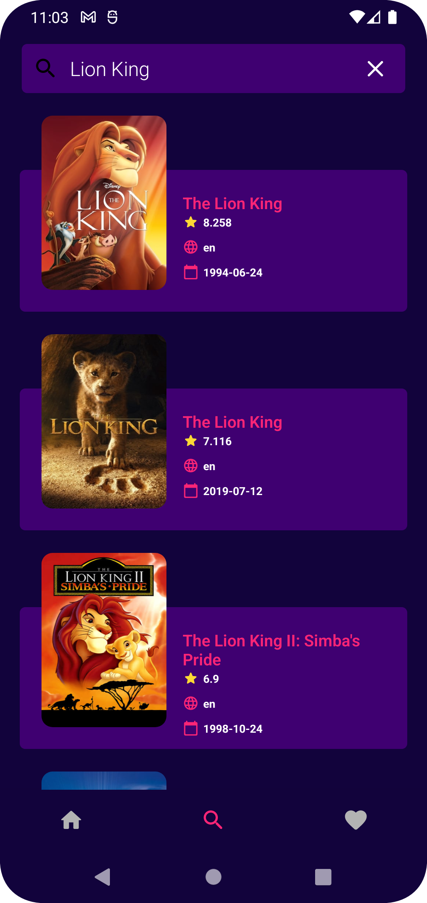
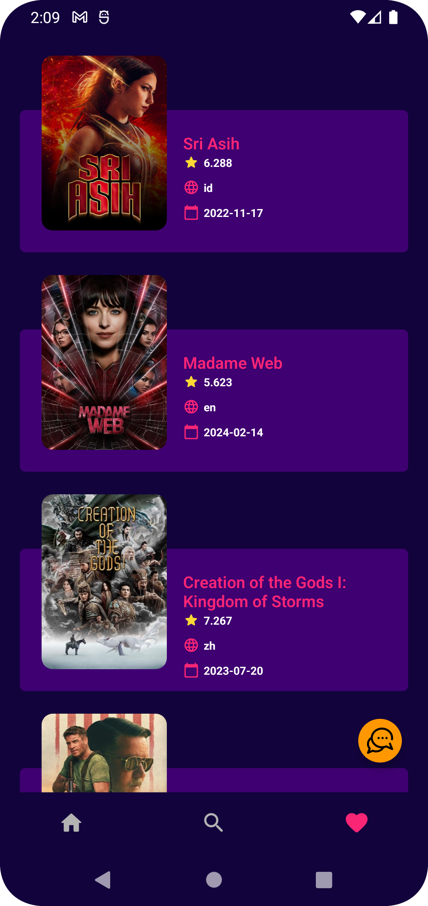

# Movie-App

This project in

- MVP architecture : Current Repo
- MVVM architecture : https://github.com/hoangtien2k3/movie-app
- The API’s Docs: https://developers.themoviedb.org/3/getting-started
- The app was written in Kotlin.

Technologies and Libraries Used :

- MVP, Navigation Component, Room Database, Retrofit
- Dagger Hilt, RxJava, View Binding, Coil

Privacy Policy: [https://www.freeprivacypolicy.com/live/f19c2183-b2ef-4ec1-b6d1-b4f9ab8dc994](https://www.freeprivacypolicy.com/live/f19c2183-b2ef-4ec1-b6d1-b4f9ab8dc994)

File APK: [https://drive.google.com/file/d/13kJG80oi93e5-XeHjzi54orYPF2je7Op/view?usp=sharing](https://drive.google.com/file/d/13kJG80oi93e5-XeHjzi54orYPF2je7Op/view?usp=sharing)

|                       |                       |                       |                       |
|-----------------------|-----------------------|-----------------------|-----------------------|
|  |  |  |  |